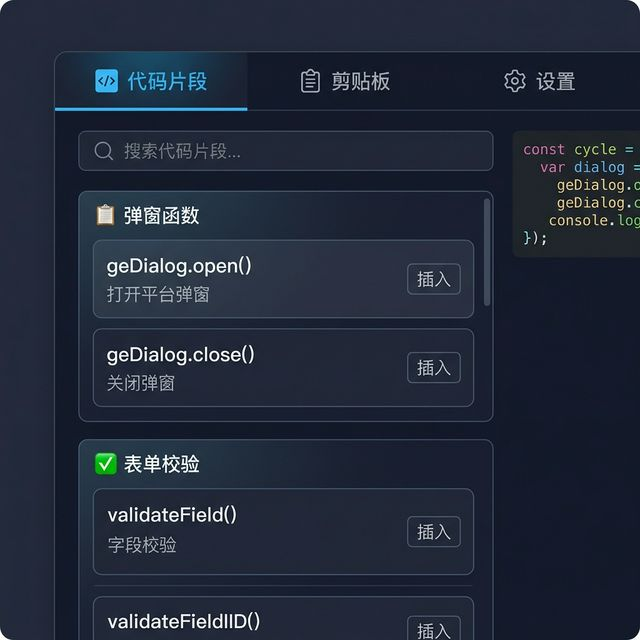

# eplat-devtools UI 交互设计文档

**文档编号**：DOC-004  
**版本**：v1.0  
**更新日期**：2026-03-19  

---

## 1. 设计原则

| 原则 | 说明 |
|------|------|
| **全中文** | 所有 UI 文案为简体中文（代码/函数名除外） |
| **暗色主题** | 深色底色 `#1a1b2e`，减少视觉疲劳 |
| **玻璃拟态** | 卡片使用半透明毛玻璃效果 |
| **最小操作** | 代码片段直接插入（含占位符），无需填写参数表单 |

---

## 2. 设计原型



---

## 3. 交互细节

### 3.1 Tab 切换

| Tab | 图标 | 说明 |
|-----|------|------|
| 代码片段 | `</>` | 默认激活，展示分类代码片段 |
| 剪贴板 | `📋` | 管理复制的 URL 和代码历史 |
| 设置 | `⚙️` | 配置项 + 模板导入管理 |

### 3.2 代码片段 Tab

```
┌─────────────────────────────────────┐
│ 🔍 搜索代码片段...                    │
├─────────────────────┬───────────────┤
│                     │               │
│  📋 弹窗函数         │  代码预览      │
│  ┌────────────────┐ │ ┌───────────┐ │
│  │ geDialog.open()│ │ │ 语法高亮   │ │
│  │ 打开平台弹窗    │ │ │ 代码块    │ │
│  │        [插入]  │ │ │           │ │
│  └────────────────┘ │ └───────────┘ │
│  ┌────────────────┐ │               │
│  │ geDialog.close()││               │
│  │ 关闭弹窗       │ │               │
│  │        [插入]  │ │               │
│  └────────────────┘ │               │
│                     │               │
│  ✅ 表单校验         │               │
│  ┌────────────────┐ │               │
│  │ validateField()│ │               │
│  │ 字段校验       │ │               │
│  │        [插入]  │ │               │
│  └────────────────┘ │               │
└─────────────────────┴───────────────┘
```

**交互**：
- 选中片段 → 右侧实时预览代码
- 点击「插入」→ 代码插入 Ace 光标位置 → 编辑器内高亮 3 秒
- 搜索实时过滤（函数名 + 描述 + 标签）

### 3.3 剪贴板 Tab

```
┌─────────────────────────────────────┐
│  📋 剪贴板历史                 [清空] │
├─────────────────────────────────────┤
│  🔗 /show-designer/dz/edit/abc123  │
│     2026-03-19 10:05         [复制] │
├─────────────────────────────────────┤
│  🔗 /BE/DZ/graphIndex.jsp          │
│     2026-03-19 09:58         [复制] │
├─────────────────────────────────────┤
│  💻 geDialog.open({...})           │
│     最近插入 · 10:02         [复制] │
└─────────────────────────────────────┘
```

**交互**：
- URL 自动提取相对路径后存入
- 插入历史自动记录
- 单项复制 / 全部清空

### 3.4 设置 Tab

```
┌─────────────────────────────────────┐
│  ⚙️ 设置                            │
├─────────────────────────────────────┤
│                                     │
│  缩放                               │
│  默认缩放级别  [100%  ▼]            │
│                                     │
│  快捷键                              │
│  唤出查找框    [Ctrl+F  ]           │
│  缩放增加      [Alt+= ]             │
│                                     │
│  模板管理                            │
│  ┌─────────────────────────────┐    │
│  │  内置模板 (3)        已加载  │    │
│  │  自定义模板 (1)      已加载  │    │
│  └─────────────────────────────┘    │
│  [导入 JSON 模板]  [预览/编辑]      │
│                                     │
│  导入后打开 JSON 预览编辑器：       │
│  ┌─────────────────────────────┐    │
│  │ {                           │    │
│  │   "category": "自定义",     │    │
│  │   "items": [...]            │    │
│  │ }                           │    │
│  └─────────────────────────────┘    │
│                                     │
│  主题  ○ 深色  ○ 浅色              │
└─────────────────────────────────────┘
```

---

## 4. 色彩系统

| 用途 | 色值 | 说明 |
|------|------|------|
| 背景 | `#1a1b2e` | 深色主背景 |
| 卡片 | `rgba(255,255,255,0.06)` | 玻璃拟态 |
| 卡片边框 | `rgba(255,255,255,0.1)` | 微弱边框 |
| 主强调 | `#4fc3f7` | 电光蓝，按钮/链接 |
| 文字主色 | `#e0e0e0` | 正文 |
| 文字次级 | `#9e9e9e` | 描述/次要信息 |
| 成功 | `#66bb6a` | 插入成功高亮 |
| 分类标题 | `#ffffff` | 加粗分类名 |
